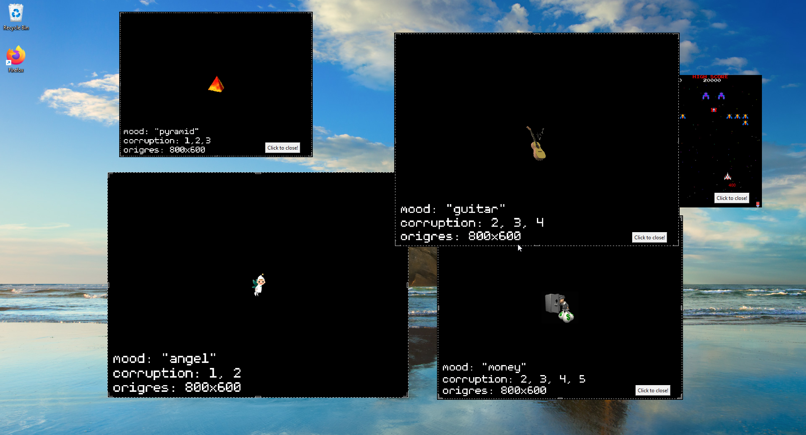

# Edgeware++

## What is EdgeWare?

Going to say immediately: **EdgeWare is not a virus, nor does it install itself onto your computer**. All it installs onto your computer by default is python 3.10 and a few extra libraries, which is needed for it to run. EdgeWare **can** potentially modify files on your computer, including deleting or replacing things, but these are all *user set* settings that are not on by default. That being said, other people can download EdgeWare, modify it to be malicious, and upload it elsewhere, so exercise caution when downloading versions from other sites. This project is open source, so feel free to peruse the source code if you're unsure.

Now, that all is pretty alarming stuff and seems a bit weird to preface the basic explanation with, but i'm fully aware the name "EdgeWare" doesn't inspire the most confidence for a program to be safe.

EdgeWare is a fetish-designed program (so 18+ only!!!) that essentially spawns popups over your screen in many different ways. These popups can include images, videos, audio, prompts (a sentence you have to repeat, think writing lines on a blackboard), etc. It's also highly customizable, with the ability to download "packs" people have made and use them yourself. Originally inspired by "Elsaware" (which, truthfully, I know nothing about), the original EdgeWare's goal was to be a "fake virus" program that looked like your computer was being taken over by porn. It can be ended at any time and also scheduled in ways to be used more passively. Even if you're not into "gooning" (having a kink for porn addiction/edging for a long time) I feel like EdgeWare is a pretty fun and interesting porn delivery system that allows you to see multiple images and videos at once without having to touch your keyboard or mouse.

PetitTournesol (EdgeWare's original creator) more or less took a hiatus and hasn't updated EdgeWare since 2022, which is totally valid. That being said, I felt like there were lots of things I personally wanted to see in the program. Inspired mostly by being mildly frustrated at deleting those dang desktop icons every time, I decided to start learning python and share the changes i've made. Thus EdgeWare++ was born, and as of writing this "new and improved" intro, there's over 10 new features to play around with. Some are quality of life updates, some are more fun things to tease yourself with. I'm generally trying to be as minimally intrusive to the original program as possible- my goal is complete both-ways pack compatibility with the old version of EdgeWare. I also don't want to remove any features (unless they were literally defunct), but I have moved some stuff around in the config menu to try and make more space.

## Usage Instructions
"So how do I start using this darn thing?" Click the big ol' "code" button in the top right, then "download zip". Save and extract it somewhere, then run "EdgewareSetup.bat". This will install python 3.10 for you, if you don't already have it. After that it will give you instructions for further use, and open up "config.pyw" in the EdgeWare subfolder.

**If you're using Linux**, first you need to install Python 3 and pip yourself, if you don't already have them installed already. Your distribution should contain packages for them. For example, on Debian and its derivatives, you can install them by running `sudo apt install python3 python3-pip`. Once you have Python and pip installed, download and extract EdgeWare as a ZIP or clone the repository, then install the dependencies by opening a terminal window in the `EdgewarePlusPlus` direcory and running `pip3 install -r requirements.txt` or `python3 -m pip install -r requirements.txt`. Now you can run EdgeWare by starting `config.pyw` or `start.pyw` with Python: `python3 path/to/file.pyw`. `config.pyw` allows you to configure EdgeWare, and `start.pyw` will start EdgeWare itself. **Please note that my primary OS is windows!** I have gotten endless help from LewdDevelopment, who also used some [pre-existing code from a old EdgeWare pull request](https://github.com/PetitTournesol/Edgeware/pull/41) to help make it happen. So if any bugs on Linux start from my own incompetence, I will consult with them and try to fix it- but know that I will not know until people tell me or them!

From there you'll need an actual pack, which can be downloaded online or made yourself. Unfortunately at the time of writing there's really no congregated directory of packs everyone's made, they're all scattered to the four winds... but for a start [the original EdgeWare page](https://github.com/PetitTournesol/Edgeware) has a few sample packs, and i'm hoping to make a few myself to showcase the new features this extension can do.

**Any damage you do to your computer with EdgeWare is your own responsibility! Please read the "About" tab in the config window and make backups if you're planning on using the advanced, dangerous settings!**

The EdgeWare++ Pack Editor is now live [here](https://github.com/araten10/EdgewareEditor-PlusPlus).

## New Features In Edgeware++:

•*Toggle that switches from antialiasing to lanczos, if Edgeware wasn't displaying popups for you this will fix that! (probably)*

•*Toggle that allows you to play videos with VLC, which not only loads faster but also should fix audio issues*

•*Toggle to enable/disable desktop icon generation*

•*Ability to cap audio/video popups if so desired, audio was previously limited to 1 and videos were uncapped*

•*Subliminals now have a % chance slider, and can also be capped*

•*Can now change startup graphic and icon per pack, defaults are used if not included*

•*Added feature to ask you to confirm before saving if there are any settings enabled that could be "potentially dangerous", for those of you like me who initially wondered if edgeware would fuck up their computer*

•*Hover tooltips everywhere to help new users get a grasp on things without having to weed through documentation*

•*Edgeware installation now actually readable and gives info on first steps*

•*Toggle that allows you to close a popup by clicking anywhere on it*

•*Import/Export buttons are now in full view at all times at the bottom of the window*

•*Brand shiny new "Pack Info" tab that gives stats and information on the currently loaded pack*

•*Simplified error console in the advanced tab, which could potentially help bugfix some things*

•*Packs now support an "info.json" file which gives people basic information about the pack in the config window*

•*Overhaul to hibernate mode which allows you to choose between multiple different types, and have your wallpaper go back to normal after you close all the popups*

•*File tab that allows you to do basic file management functions*

•*Adding functionality to moods, allowing you to toggle them off/on*

•*"Single Mode", allowing only one popup to spawn per popup roll, making for a more consistent experience if desired*

•*Different graphical themes, including dark mode (and a few other fun ones!)*

•*Allowing creation of a per-pack config setup, to help pack creators show off their "intended" settings*

•*Moving Popups, which bounce around the screen [like some other infamous programs](https://www.youtube.com/watch?v=LSgk7ctw1HY)*

•*Subliminal Message popups, which use the captions file to flash short mantras up randomly*

•*Experimental Linux support that may or may not break in the future (read the section above!)*

## Planned Additions:

•*Giving mitosis a percentage activation slider*

•*Rewriting all the old config presets ~~to work with the new version~~, and a few new ones as well!* (turns out the old configs work fine (at least for me), but they could do with a little updating for new settings)

•*Allowing users to write config preset descriptions in the config window*

•*Allowing pack creators to somehow make Edgeware "change over time", for example, getting more depraved or having the themes change the longer it runs. Would likely use the mood system.*

•*Making a demo video/images so people can get an idea of what they're downloading ~~but this might take a while since it requires me to clean my desktop~~*

•*Making some new demo packs showcasing added features, allows me to not only show off my work but also be a horny bastard and browse porn*

I'm also wanting to add features to the pack editor, will probably do that when this is in a state where I feel mostly done with what I wanted to accomplish.

**Suggestions**

Suggestions I got from people who used the software and I thought would be interesting enough to try. Lower priority than my own planned additions, but still something I hope to add (or attempt to) in the future!

•*Randomized settings button*

•*Support for confining edgeware to a single monitor, which actually sounds like a really good idea but i'd want to test it on a few monitor setups and it sounds fairly technical*

•*Windows "stealing focus", forcing you to do things like enter prompts before you're allowed to do anything else*

•*Different folder for long audio files or "BGM", to be able to separate short and longer sounds (or another solution to this if not a folder)*

•*Themes being able to associate with moods*

•*Popup opening/closing sounds, would also theoretically hook into moods as well*
## Packs

[**EdgeWare++ Test Pack**](https://mega.nz/file/0acUQarB#QNyaZPkGYOGQgOi_W-up6n14rv_w8NSP-hN16qczC44)
**Version: 1**
A test pack featuring a sampler of all (finished) features found in EdgeWare++, and the pack i've been using to test functionality in. Some features are not complete and will be patched in as time goes on.
## Frequently Asked Questions

>Q: Where do I download more packs?

A: Unfortunately, packs are kind of scattered about... Since there is no specific place to congregate EdgeWare packs (to my knowledge), people usually end up posting them to their personal twitters or discord servers. Additionally, some people charge money for their own packs and/or bundle a complete copy of EdgeWare with their pack, making it even harder to give a definite answer to this question.

There are a few places you can start, however. PetitTournesol's original github page has multiple packs, although they don't support new ++ features. /r/edgingware on reddit is mostly focused to tech support, but there are multiple packs there, including a helpful reference pack. I believe hgoon.booru also has a thread for EdgeWare packs on the forum, but since it's a bit of an obscure booru and requires an account to post, i'm sure many still fall through the cracks.

>Q: Can you give me more info on upcoming features?

A: I personally like to reveal things once they're at the point where i'm not going to turn back or change my mind on them, as I think sometimes revealing things too early kills motivation and adds a lot of stress. I also get easily distracted and absentminded (don't we all...) so I can't guarantee that anything I announce early will actually happen anytime soon. Because of this I don't like to give out information on upcoming features to people, but I do post general updates/ideas on my [twitter account](https://twitter.com/ara10ten), which also serves as a point of contact/a place for me to ramble about horny things!

>Q: Why are my videos silent/why do videos not work?

A: You might be one of the many people affected by the **python video player bubonic plague**! Jokes aside, the default video player that EdgeWare used is really janky and mostly left in for ease of use and compatibility. In EdgeWare++ I have added support for libvlc, which has it's own plethora of problems i'm sure, but is generally more stable and fixes these issues. Head on over to [vlc's website](https://www.videolan.org/vlc/) and download **the correct VLC for your hardware** (extra emphasis on this, check if you're 64-bit!). Then go to the troubleshooting tab and enable VLC playback once you've installed it.

>Q: I opened up the debug script after using VLC, and oh my god, there's a horrifying amount of errors being spit out into console!

A: I guarantee this won't be a frequently asked question, but when else am I going to talk about it? I found a fix for this [here](https://stackoverflow.com/questions/68246840/how-to-avoid-main-libvlc-error-when-using-the-python-vlc-package), assuming it's the "stale plugins cache" error.

>Q: Can we be friends/talk more/can I dom you?

A: I am a creature by night, and keep to the shadows. (this is an edgy way of saying i'm quiet and autistic, I generally have a low social battery)

But also feel free to follow me on twitter, interact with me there, and other such things! I don't bite!

The changelog can be viewed [here](CHANGELOG.md).
